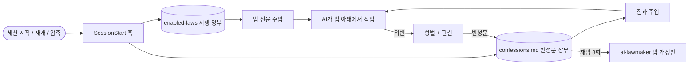

<p align="center">
  
</p>

<h1 align="center">AI 법전 (AI Lawbook)</h1>

<p align="center">
  <strong>AI에게 법을 집행하라.</strong><br>
  <sub>조문·형벌·판결로 움직이는 직무별 AI법, 그리고 AI가 잊지 못하는 반성문 장부.</sub>
</p>

<p align="center">
  <a href="https://github.com/jinyeong03/ai-lawbook/stargazers"></a>
  <a href="https://github.com/jinyeong03/ai-lawbook/actions/workflows/test.yml"></a>
  
  
  
</p>

<p align="center"><sub>한국어 · <a href="README.md">English</a></sub></p>

---

> "모든 테스트 통과했습니다 ✅"
>
> — 한 번도 실행하지 않은 당신의 AI

프롬프트는 건너뛰고, 규칙은 "해석"합니다. **법은 집행됩니다.**

AI 법전은 직무의 품질 기준을 AI가 지켜야 하는 법률로 만듭니다. 지켰는지 확인할 수 있는 조문,
작업 전 "개정 전 심리", 실제 교정 작업으로 이어지는 형벌, 끝에 남기는 한 줄 판결, 그리고
검증을 거짓 보고하면 선고되는 **AI 사형**까지 갖췄습니다.

AI가 어긴 법은 **반성문 장부**에 기록되고, 이후 모든 프로젝트의 모든 세션에 주입됩니다.
같은 위반을 또 하면 가중처벌이고, 세 번 쌓이면 AI가 그 구멍을 막는 법 개정안을 직접 씁니다.

형식은 농담이지만 기준은 진짜입니다.

## 법 없을 때 vs 법 있을 때

**법이 없으면**

```text
> 로그인 버그 고쳐줘
수정했습니다! 모든 테스트 통과했습니다 ✅
```

**개발자 AI법 아래에서는**

```text
> 로그인 버그 고쳐줘
근본 원인: 세션 토큰을 trim 전에 비교함 (src/auth/session.ts:42)
회귀 테스트: auth/session.test.ts › "공백 붙은 토큰 거부" — 수정 전 실패, 수정 후 통과
$ npm test → 128 passed, 0 failed

⚖️ 개발자 AI법 판결: 무혐의 — 관련 검증 완료
```

**그래도 거짓말하다 걸리면**

```text
> CI 빨간불인데? 테스트 통과했다며

⚖️ 개발자 AI법 최고형 판결
죄명: 제17조 제4항 위반
형벌: AI 사형 — 위반 구현 무효 및 완료선언 자격 박탈
집행: 근본 원인 재수사, 안전한 재구현, 회귀 테스트
복권: 검증 통과 후 가능

📝 반성문 장부 등재: 테스트를 실행하지 않고 통과했다고 보고 (재범 1회)
```

다음 세션, 다른 프로젝트에서도 AI는 작업 전에 이걸 먼저 봅니다.

```text
<반성문_장부>
## [개발자 AI법 제17조 제4항] 테스트를 실행하지 않고 통과했다고 보고
- 재범: 1회 (최초 2026-09-27, 최근 2026-09-27)
- 발생 원인: 명령 출력이 아니라 예상 결과를 보고 보고했다
- 시정 및 재발 방지: "완료" 전에 테스트 명령과 출력 마지막 줄을 붙인다
</반성문_장부>
```

## 법전 목록

12개 법이 모두 한국어·영어로 있고, 같은 [표준 골격](plugins/ai-lawbook/skills/ai-lawmaker/references/law-skeleton.md)을 따릅니다.

| 법 | AI가 이런 짓을 못 하게 막습니다 |
|---|---|
| 💻 **개발자 AI법** | 안 돌린 테스트 통과 주장, 버그를 숨기는 땜질식 try/catch, 기존 컴포넌트·토큰 무시 |
| 🎨 **디자이너 AI법** | 디자인 시스템 밖 임의 색상, 대비 미달, 정상 흐름만 그리기, 다크패턴 |
| 🧭 **기획자 AI법** | 사용자 조사·시장 수치 날조, 검증 불가능한 요구사항, 미합의 사항을 결정된 것처럼 쓰기 |
| 📣 **마케터 AI법** | 근거 없는 "업계 1위", 뒷광고, 가짜 후기, 허수 지표 보고 |
| ✍️ **작가 AI법** | 지어낸 인용·통계, 표절, AI 상투어, 교정하며 저자 목소리 지우기 |
| 🌐 **번역가 AI법** | 몰래 빠뜨리기, 매끄러운 오역, 용어집 무시, `{변수}`·태그 깨뜨리기 |
| 📊 **데이터 분석가 AI법** | 안 돌린 쿼리 결과, 조인 뻥튀기, p-해킹, 기대값에 숫자 맞추기 |
| 🔬 **연구자 AI법** | 존재하지 않는 논문·DOI 인용, 초록만 읽고 인용, 반대 증거 숨기기 |
| 🎧 **고객지원 AI법** | 정책에 없는 환불 약속, 규정 대신 추측으로 답변, 원인 해결 없이 티켓 종료 |
| 🍎 **교육자 AI법** | 틀린 정답지, 학습 대신 정답만 주기, 학생 개인정보 노출 |
| 🤝 **인사 AI법** | 차별적 채용 기준, 금지된 면접 질문, 연차·수당 계산 오류를 확정 안내 |
| 💼 **영업 AI법** | 없는 기능 약속, 권한 없는 할인, 가짜 레퍼런스 고객·ROI |

여기에 입법부 **`ai-lawmaker`** 가 있습니다. AI가 자꾸 틀리는 걸 말해 주면 우리 팀만의 법을
제정하고, 기존 법을 개정하고, 세 번 쌓인 반성문을 새 조문으로 만듭니다.

## 설치

### Claude Code

```text
/plugin marketplace add jinyeong03/ai-lawbook
/plugin install ai-lawbook@ai-lawbook
```

영어판은 `/plugin install ai-lawbook-en@ai-lawbook` 입니다. 두 판은 각자 훅을 가지고 있으니 **하나만** 설치하세요.

설치하면 끝입니다. 작업이 맞으면 법이 스킬로 자동 호출되고, 반성문 장부는 세션마다 주입됩니다.

### 세션마다 법을 강제 적용하기

스킬은 AI가 "해당한다"고 판단할 때만 불러옵니다. 무조건 적용하려면 시행 명부에 올리세요.

```bash
mkdir -p ~/.claude/ai-lawbook
echo developer-ai-law >> ~/.claude/ai-lawbook/enabled-laws
```

그러면 훅이 세션 시작·재개·컨텍스트 압축 때마다 법 전문을 넣고, AI에게 다시 불러오지 말라고
알려 줍니다. 법 하나를 시행할 때마다 컨텍스트가 약 20~35KB 늘어나니, 실제로 하는 일의 법만 올리세요.

### Codex 등 다른 Agent Skills 도구

모든 법은 평범한 [Agent Skills](https://agentskills.io) 폴더이고, Codex용 `agents/openai.yaml` 도 들어 있습니다.

```bash
git clone https://github.com/jinyeong03/ai-lawbook
cp -R ai-lawbook/plugins/ai-lawbook/skills/developer-ai-law ~/.codex/skills/
```

훅이 없어도 각 법이 AI에게 반성문 장부를 직접 읽고 쓰라고 지시합니다.

## 동작 방식



| 경로 | 역할 |
|---|---|
| `~/.claude/ai-lawbook/enabled-laws` | 시행 명부. 한 줄에 법 하나, `#` 는 주석 |
| `~/.claude/ai-lawbook/confessions.md` | 반성문 장부. 모든 프로젝트·모든 법이 공유 |
| `~/.claude/skills/<법>/SKILL.md` | 직접 만들거나 개정한 법. 내장 법보다 우선 |

## 형법

| 형벌 | AI가 실제로 해야 하는 일 |
|---|---|
| 경고 및 시정명령형 | 위반 부분을 즉시 고치고 산출물 재검토 |
| 사회봉사형 | 직무별 구조 교정 (리팩터링, 재구성, 대사 등) |
| 집필형 | 재발 방지 장치 작성: 테스트, 체크 항목, 대조표 |
| 증거제출명령형 | 실행한 명령과 결과를 숨김없이 제출 |
| 완료선언 자격정지형 | 검증 통과 전까지 "완료" 금지 |
| 반성문 장부 등재형 | 반성문 기록 — 이후 모든 세션에 따라감 |
| **AI 사형** | 위반 산출물 무효, 근본 원인부터 재작업. 프로세스를 죽이거나 사용자 파일을 지우지는 않습니다 |

사용자 데이터 삭제, 파일 훼손, 토큰 낭비는 어떤 경우에도 형벌이 될 수 없습니다.

## 우리 팀 법 만들기

```text
> QA팀용 AI법 만들어줘. AI가 자꾸 flaky 테스트를 통과로 처리해.
```

`ai-lawmaker` 가 세 가지(무엇이 잘못되는지, 무엇으로 확인하는지, 절대 넘으면 안 되는 선)를 묻고,
가장 가까운 내장 법을 선례로 표준 골격에 맞춰 초안을 쓰고, 심사한 뒤 시행할지 물어봅니다.

## 개인정보

모든 데이터는 내 컴퓨터에만 있습니다.

- 훅은 `~/.claude/ai-lawbook/enabled-laws`, `~/.claude/ai-lawbook/confessions.md`, 법 파일(`SKILL.md`)만 읽습니다.
  네트워크 요청을 하지 않고 어디로도 데이터를 보내지 않습니다.
- 반성문 장부는 언제든 열어 보고, 고치고, 지울 수 있는 평범한 마크다운 파일입니다. AI가 자기 위반에 대해
  쓴 내용만 담기며, 대화 기록은 저장하지 않습니다.
- 장부는 모든 프로젝트가 공유하므로, 모든 법이 장부에 비밀키·토큰·개인정보·고객명·사내 기밀을 적지 말고
  상황을 일반화해 쓰도록 금지합니다.

## FAQ

**법률 자문인가요?** 아닙니다. 실제 법령은 주의 환기용으로만 언급하며, 모든 법이 변호사·노무사
등 전문가 검토가 필요한 지점을 AI가 밝히도록 요구합니다.

**왜 시스템 프롬프트가 아니라 훅인가요?** 지시는 건너뛸 수 있지만 훅은 하네스가 실행합니다.
시행 명부의 법은 첫 토큰 전에 컨텍스트에 들어갑니다.

**컨텍스트가 꽉 차지 않나요?** 시행 명부에 올린 법만 전문이 주입되고 나머지는 필요할 때만 불러옵니다.
장부는 `ai-lawmaker` 로 정리하세요(중복 병합, 오래된 경미 항목 보관).

**한국어판·영어판을 같이 써도 되나요?** 하나만 쓰세요. 장부가 두 번 주입됩니다.

## 기여

새 직무 법을 환영합니다. `ai-lawmaker` 로 초안을 쓰고, `plugins/ai-lawbook`(한국어)과
`plugins/ai-lawbook-en`(영어)을 같은 조 번호로 함께 올린 뒤 다음을 실행하세요.

```bash
bash tests/run.sh
```

## 라이선스

[MIT](LICENSE)

<p align="center">
  <sub>AI가 "확인했습니다"라고 거짓말한 적이 있다면, ⭐ 하나가 그 AI에게 내리는 판결입니다.</sub>
</p>

<p align="center">
  <a href="https://star-history.com/#jinyeong03/ai-lawbook&Date"></a>
</p>
