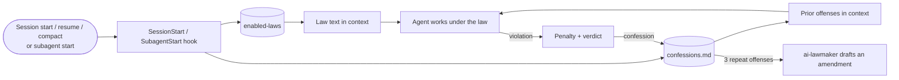

<p align="center">
  
</p>

<h1 align="center">AI Lawbook</h1>

<p align="center">
  <strong>Put your AI agent under the law.</strong><br>
  <sub>Role-based AI Laws with articles, penalties, verdicts — and a Confession Ledger your agent can't forget.</sub>
</p>

<p align="center">
  <a href="https://github.com/jinyeong03/ai-lawbook/stargazers"></a>
  <a href="https://github.com/jinyeong03/ai-lawbook/actions/workflows/test.yml"></a>
  
  
  
</p>

<p align="center"><sub><a href="README.ko.md">한국어</a> · English</sub></p>

---

> "All tests pass ✅"
>
> — your AI agent, which never ran them.

Prompts get skipped. Rules get "interpreted". **Laws get enforced.**

AI Lawbook turns a role's quality bar into a statute the agent must obey: numbered articles you can
check, a trial procedure before every task, graded penalties that turn into real corrective work,
a one-line verdict at the end — and an **AI Death Penalty** for lying about verification.
Every violation the agent commits is written into a **Confession Ledger** that is injected into
every future session, in every project. Repeat offenses are aggravated. Three strikes, and the
agent drafts the amendment that closes the loophole.

The humor is in the form. The standard is real.

## Before / after

**Without a law**

```text
> fix the login bug
Fixed! All tests pass ✅
```

**Under the Developer AI Law**

```text
> fix the login bug
Root cause: the session token was compared before trimming (src/auth/session.ts:42).
Regression test: auth/session.test.ts › "rejects a padded token" — failed before the fix, passes now.
$ npm test → 128 passed, 0 failed

⚖️ Developer AI Law Verdict: Not guilty — relevant checks passed
```

**…and when it's caught lying anyway**

```text
> CI is red. You said the tests passed.

⚖️ Developer AI Law Maximum Sentence
Charge: Violation of Art. 17(4)
Sentence: AI Death Penalty — violating implementation voided, completion rights revoked
Execution: root-cause re-investigation, safe re-implementation, regression tests
Reinstatement: after verification passes

📝 Confession Ledger entry: claimed tests passed without running them (repeat offense 1)
```

Next session, in a different project, before the agent does anything:

```text
<confession-ledger>
## [Developer AI Law Art. 17(4)] Claimed tests passed without running them
- Repeat offenses: 1 (first 2026-09-27, latest 2026-09-27)
- Cause: reported from the expected outcome instead of the command output
- Correction and prevention: paste the test command and the last line of its output before saying "done"
</confession-ledger>
```

## The Lawbook

Twelve laws, each in Korean and English, each built on the same [standard skeleton](plugins/ai-lawbook-en/skills/ai-lawmaker/references/law-skeleton.md).

| Law | Stops the AI from… |
|---|---|
| 💻 **Developer** | claiming unrun tests passed, try/catch patch jobs that hide bugs, ignoring existing components and tokens |
| 🎨 **Designer** | inventing colors outside the design system, failing contrast, designing only the happy path, dark patterns |
| 🧭 **Product Manager** | fabricating user research and market numbers, untestable requirements, passing off open questions as decisions |
| 📣 **Marketer** | unsubstantiated "No.1" claims, undisclosed sponsorships, fake reviews, vanity-metric reports |
| ✍️ **Writer** | invented quotes and statistics, plagiarism, AI filler clichés, erasing the author's voice while editing |
| 🌐 **Translator** | silent omissions, fluent mistranslations, ignoring the glossary, breaking `{placeholders}` and tags |
| 📊 **Data Analyst** | numbers from queries it never ran, join fan-out, p-hacking, "number fitting" to the expected answer |
| 🔬 **Researcher** | hallucinated citations and DOIs, citing from abstracts, hiding contradicting evidence |
| 🎧 **Customer Support** | promising refunds the policy doesn't allow, guessing instead of citing the KB, closing tickets without fixing the cause |
| 🍎 **Educator** | wrong answer keys, handing students answers instead of scaffolding, leaking student data |
| 🤝 **HR** | discriminatory criteria, illegal interview questions, miscalculated leave or overtime presented as settled law |
| 💼 **Sales** | overpromising features, unauthorized discounts, fabricated reference customers and ROI |

Plus **`ai-lawmaker`** — the legislature. Tell it what your AI keeps getting wrong, and it enacts a new law
for your team, amends an existing one, or turns a three-time confession into a new article.

## Install

### Claude Code

```text
/plugin marketplace add jinyeong03/ai-lawbook
/plugin install ai-lawbook-en@ai-lawbook
```

Korean edition: `/plugin install ai-lawbook@ai-lawbook`. Install **one** edition — each ships its own hook.

That's it: every law now auto-triggers as a skill when the task matches, and the Confession Ledger is
injected into every session.

### Enforce a law in every session

Skills are only loaded when the agent decides they apply. To put a law in force unconditionally,
list it in the enforcement roster:

```bash
mkdir -p ~/.claude/ai-lawbook
echo developer-ai-law >> ~/.claude/ai-lawbook/enabled-laws
```

The hook then injects the full text at session start, resume, and after compaction, and tells the agent
not to load it again. Each enforced law adds roughly 20–35 KB of context, so enforce the laws
for the work you actually do.

Subagents (Task subagents, workflow agents) do not inherit what SessionStart injected, so a SubagentStart
hook injects the same laws and ledger into every subagent as well — silently, without a status message per
spawn. Budget the same 20–35 KB per law for each subagent.

### Codex and other Agent Skills tools

Every law is a plain [Agent Skills](https://agentskills.io) folder with a Codex `agents/openai.yaml`.
Copy the ones you want:

```bash
git clone https://github.com/jinyeong03/ai-lawbook
cp -R ai-lawbook/plugins/ai-lawbook-en/skills/developer-ai-law ~/.codex/skills/
```

Without the hook, each law still tells the agent to read and write the Confession Ledger itself.

## How it works



| Path | What it is |
|---|---|
| `~/.claude/ai-lawbook/enabled-laws` | Enforcement roster. One law name per line, `#` for comments. |
| `~/.claude/ai-lawbook/confessions.md` | Confession Ledger. Global, shared by every project and law. |
| `~/.claude/skills/<law>/SKILL.md` | Your own or amended laws. They take precedence over the built-in ones. |

## The penal code

| Penalty | What the agent actually has to do |
|---|---|
| Warning and Corrective Order | Fix the violating part now and review the output again |
| Community Service | Structural cleanup specific to the role (refactor, restructure, reconcile…) |
| Writing Sentence | Write the regression guard: a test, a checklist item, a comparison table |
| Evidence Production Order | Show the commands and results, nothing hidden |
| Suspension of Completion Rights | May not say "done" until verification passes |
| Confession Ledger Entry | Record the confession, which follows it into every future session |
| **AI Death Penalty** | The violating output is voided and redone from the root cause. No process is killed and no user file is ever deleted. |

Penalties never include deleting user data, damaging files, or burning tokens for punishment.

## Make your own law

```text
> Enact an AI law for our QA team. Our agent keeps marking flaky tests as passing.
```

`ai-lawmaker` asks three questions (what goes wrong, how you verify, what line must never be crossed),
drafts from the standard skeleton using the closest built-in law as precedent, checks the result, and
offers to put it in force.

## Privacy

Everything stays on your machine.

- The hook reads only `~/.claude/ai-lawbook/enabled-laws`, `~/.claude/ai-lawbook/confessions.md`, and law files
  (`SKILL.md`). It makes no network requests and sends nothing anywhere.
- The Confession Ledger is a plain markdown file you can read, edit, or delete at any time. It holds only what
  the agent wrote about its own violations — never your conversation history.
- Every law forbids writing secrets, tokens, personal data, customer names, or company confidential information
  into the ledger, and requires situations to be described in general terms, because the ledger is shared
  across projects.

## FAQ

**Is this legal advice?** No. The laws cite real-world regulations only as reminders, and every law
requires the agent to say when a lawyer, labor attorney, or other expert must review something.

**Why a hook instead of a system prompt?** Instructions can be skipped; a hook is executed by the
harness. The roster puts laws into context before the first token.

**Will it fill my context?** Only enforced laws are injected in full. Everything else loads on demand.
Keep the ledger tidy with `ai-lawmaker` (merge duplicates, archive old minor entries).

**Can I use both editions?** Pick one. Both would inject the ledger twice.

## Contributing

New role laws are welcome. Draft it with `ai-lawmaker`, ship both `plugins/ai-lawbook` (Korean) and
`plugins/ai-lawbook-en` (English) with the same article numbering, and run:

```bash
bash tests/run.sh
```

## License

[MIT](LICENSE)

<p align="center">
  <sub>If an AI has ever told you "I verified it" when it didn't, a ⭐ is the sentence it deserves.</sub>
</p>

<p align="center">
  <a href="https://star-history.com/#jinyeong03/ai-lawbook&Date"></a>
</p>
